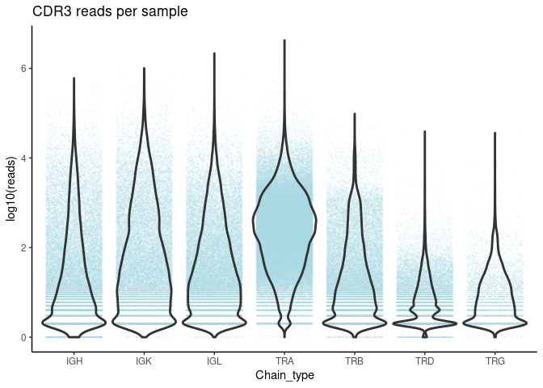

```r
library(tidyverse); library(vroom)
```

```
## ── Attaching packages ────────────────────── tidyverse 1.3.0 ──
```

```
## ✓ ggplot2 3.3.2     ✓ purrr   0.3.4
## ✓ tibble  3.0.3     ✓ dplyr   1.0.2
## ✓ tidyr   1.0.3     ✓ stringr 1.4.0
## ✓ readr   1.3.1     ✓ forcats 0.5.0
```

```
## ── Conflicts ───────────────────────── tidyverse_conflicts() ──
## x dplyr::filter() masks stats::filter()
## x dplyr::lag()    masks stats::lag()
```

### Load in Imrep CDR3 data

```r
df <- vroom("/labs/khatrilab/solomonb/201912111345.csv") 
```

```
## New names:
## * `` -> ...1
```

```
## Rows: 18,858,328
## Columns: 8
## Delimiter: ","
## chr [5]: sra, CDR3_AA_Seq, Chain_type, V_chains, J_chains
## dbl [2]: ...1, Read_count
## lgl [1]: D_chains
## 
## Use `spec()` to retrieve the guessed column specification
## Pass a specification to the `col_types` argument to quiet this message
```

### Number of unqique CDR3 sequences

**For all antigen receptor chains**

```r
df %>% 
  mutate(chain_cdr3 = paste(Chain_type, CDR3_AA_Seq, sep ="_")) %>% 
  summarise(unique_cdr3 = length(unique(chain_cdr3)), 
            total_reads = sum(Read_count), 
            total_sra = length(unique(sra))) %>% 
  mutate(reads_per_cdr3 = total_reads/unique_cdr3,
          cdr3_per_sra = unique_cdr3/total_sra,
          reads_per_sra = total_reads/total_sra) %>% 
  mutate_if(is.numeric, 
                function(x) ifelse(x >= 10000, 
                                   scales::scientific_format(digits = 3)(round(x)), 
                                   round(x)))
```

```
## # A tibble: 1 x 6
##   unique_cdr3 total_reads total_sra reads_per_cdr3 cdr3_per_sra reads_per_sra
##   <chr>       <chr>       <chr>              <dbl>        <dbl>         <dbl>
## 1 1.56e+07    2.96e+08    8.34e+04              19          187          3547
```

**By antigen receptor chain groups**

```r
df %>% 
  group_by(Chain_type) %>% 
  summarise(unique_cdr3 = length(unique(CDR3_AA_Seq)), 
            total_reads = sum(Read_count), 
            total_sra = length(unique(sra))) %>% 
  mutate(reads_per_cdr3 = total_reads/unique_cdr3,
          cdr3_per_sra = unique_cdr3/total_sra,
          reads_per_sra = total_reads/total_sra) %>% 
  mutate_if(is.numeric, 
                function(x) ifelse(x >= 10000, 
                                   scales::scientific_format(digits = 3)(round(x)), 
                                   round(x)))
```

```
## `summarise()` ungrouping output (override with `.groups` argument)
```

```
## # A tibble: 7 x 7
##   Chain_type unique_cdr3 total_reads total_sra reads_per_cdr3 cdr3_per_sra
##   <chr>      <chr>       <chr>       <chr>              <dbl>        <dbl>
## 1 IGH        2.52e+06    4.52e+07    3.93e+04              18           64
## 2 IGK        2.05e+05    7.72e+07    3.21e+04             377            6
## 3 IGL        2.30e+05    3.83e+07    3.85e+04             167            6
## 4 TRA        1.21e+07    1.24e+08    8.32e+04              10          145
## 5 TRB        5.05e+05    1.08e+07    3.71e+04              21           14
## 6 TRD        7.70e+04    6.08e+05    2.60e+04               8            3
## 7 TRG        6400        2.37e+05    6443                  37            1
## # … with 1 more variable: reads_per_sra <dbl>
```


### Number of reads per sample


```r
df.summary <- df %>% 
  group_by(sra, Chain_type) %>% 
  summarise(reads = sum(Read_count), sequences = length(Read_count)) %>%  
  mutate(reads_per_sequence = reads/sequences)
```

```
## `summarise()` regrouping output by 'sra' (override with `.groups` argument)
```

```r
# df.thresh <- df.cdr3Count %>% filter(n > 100)
df.summary %>% 
  ggplot(aes(x = Chain_type, y  = log10(reads))) +
  geom_jitter(size = 0.1, alpha = 0.1, color = "lightblue")+
  geom_violin(scale = "width", size = 1, fill = NA)+
  theme_classic() +
  ggtitle("CDR3 reads per sample")
```

<!-- -->

### Number of unique CDR3s per sample


```r
df.summary %>% 
  ggplot(aes(x = Chain_type, y  = log10(sequences))) +
  geom_jitter(size = 0.1, alpha = 0.1, color = "lightblue")+
  geom_violin(scale = "width", size = 1, fill = NA)+
  theme_classic()+
  ggtitle("Unique CDR3 sequences per sample")
```

<!-- -->

### Number of reads per unique CDR3 


```r
df.summary %>% 
  ggplot(aes(x = Chain_type, y  = log10(reads_per_sequence))) +
  geom_jitter(size = 0.1, alpha = 0.1, color = "lightblue")+
  geom_violin(scale = "width", size = 1, fill = NA)+
  theme_classic()+
  ggtitle("Reads per unique CDR3 sequence per sample")
```

<!-- -->
